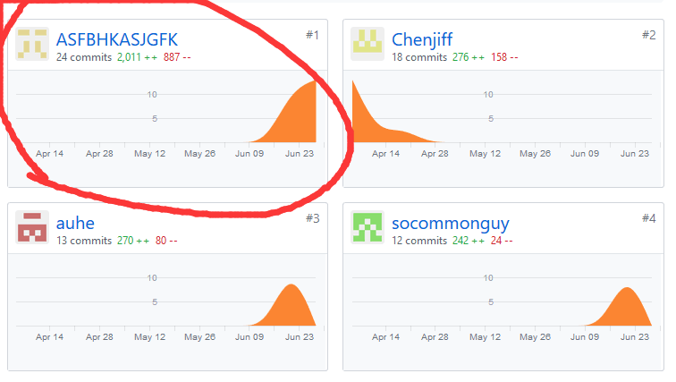
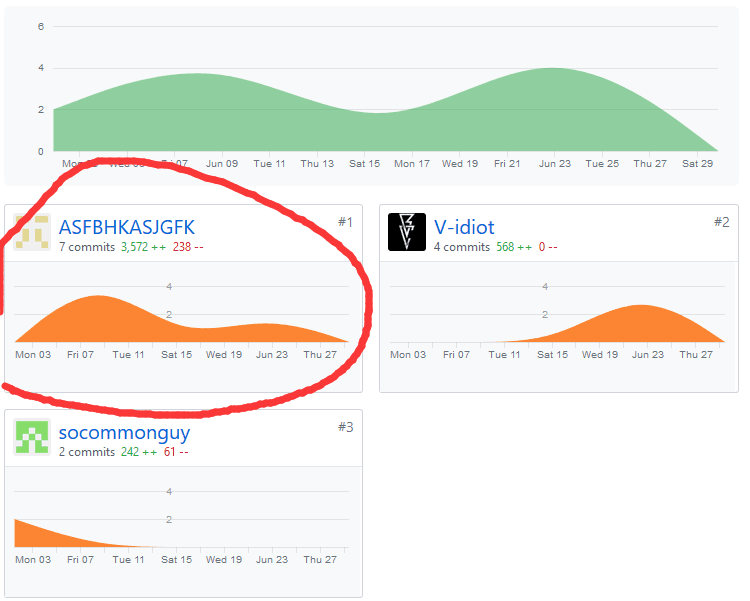

# 个人总结
姓名：陈金坤 学号：16340021

昵称：ASFBHKASJGFK

分工：前端小组长

完成工作：发布任务界面、进行中任务界面、发现任务界面、填写问卷界面、发布者问卷查询界面（js+wxml+wxss）+使用手册+用例设计文档(任务用例)+前端规范+后端规范
- 慢慢的走过来，才发现，我们写wxss竟然能被那么多页面用，写的wx.reques()网络请求竟然也都差不多。真正硬核的地方又变成了美化和用户体验，总结了话就是，这个项目其实工作量蛮大的，如果没协调好，往往很久这个项目都不会向着我们想象的方向前进，有时候自己的努力是微乎其微的，就那种你做好了第几版的前端，好像没有后台的数据，你就是在闭门造车，当一直被这影响的时候，对自己写的测试数据一遍一遍的怀疑，对自己的页面一次一次抄起手术刀，都只会让这个项目往后拖延。所以团队的作用就是“我给你这个数据行不行”“稳的稳的”“我看看你显示出来啥样”快速迭代就完事了。

# PSP  2.1 统计表
| PSP2.1 | Personal Software Process Stages | Time (%) |
| ---- | ---- | ---- |
| __Planing__ | __计划__ | __7__ |
| Estimate | 预估任务时间 | 7 |
| __Development__ | __开发__ | __85__ |
| Analysis | 需求分析 | 10 |
| Design Spec | 生成设计文档 | 15 |
| Design Review | 设计复审 | 2 |
| Coding Standard | 生成代码规范 | 3 |
| Design | 具体设计 | 10 |
| Coding | 具体编码 | 30 |
| Code Review | 代码复审 | 5 |
| Test | 测试 | 5 |
| __Reporting__ | __报告__ | __8__ |
| Test Report | 测试报告 | 5 |
| Size Measurement | 计算工作量 | 1 |
| Process Improvement Plan | 事后总结及改进计划 | 2 |

# Git Stat

此为前端贡献记录

此为Dashboard共享记录

# 最得意的工作
- 完成了问卷的数据处理，我们后端大佬给的数据结构为问题1@@问题2@@问题3，在他们已经部署完的情况下我也理解他们没有办法更改数据库和数据类型，然而前端的数据结构创建的问卷就是{[问题1][问题2]}，没办法，暴力破解就完事了，在提交问卷这个button里塞进去了数据转换的逻辑。本来觉得会让页面渲染变慢很多，没想到我们测试用的1+7pro还是那么给劲，一点卡顿都没有的
- 在项目最初，大家都不知道小程序前端是个啥东西的时候，我偷偷下了一个微信开发者工具，然后把下面的状态栏建立起来，每一个需要的page创建出来，突然感觉好像设计一个小程序也并不是多难（？），就这样抢到了前端小组长的任务，挺开心的，
- 在最后一部分工作时，我们前端的代码直接放到组长（后端大佬）那里，他直接和我们进行0距离测试，自己也装了一个前端开发者工具，前后端一块改，让每一个bug消失的很快，当然在这个时候，最开心的还是我，因为看到自己的逻辑接收到后台的数据并且成功显示出来的时候，真的很得意，总算我对着api一点一点写的测试数据没有浪费。

# 个人博客
写到技术报告里了

# 致谢
当你觉得自己是一个弟弟的时候，没有关系，看一看队友，他们也是弟弟，还是没有关系；因为指不定什么时候，就蹦出来了一个独当一面的人，第二个，第三个，然后我们的队伍就会变成独当一面的可靠的队伍
- 致谢我的组长陈吉凡同学，13、4周的时候天天带着笔记本改来改去，然后后端就成了..成了...了，然后还给予了前端很大的帮助，甚至还抵御了黑客对我们服务器的攻击hhhhh
- 致谢我们的陈泓霖同学，项目刚启动就把UI设计拍到了我们脸上，后阶段的开发和文档工作中很可靠
- 再感谢小组其他成员，在最后的文档工作中贡献了很多

