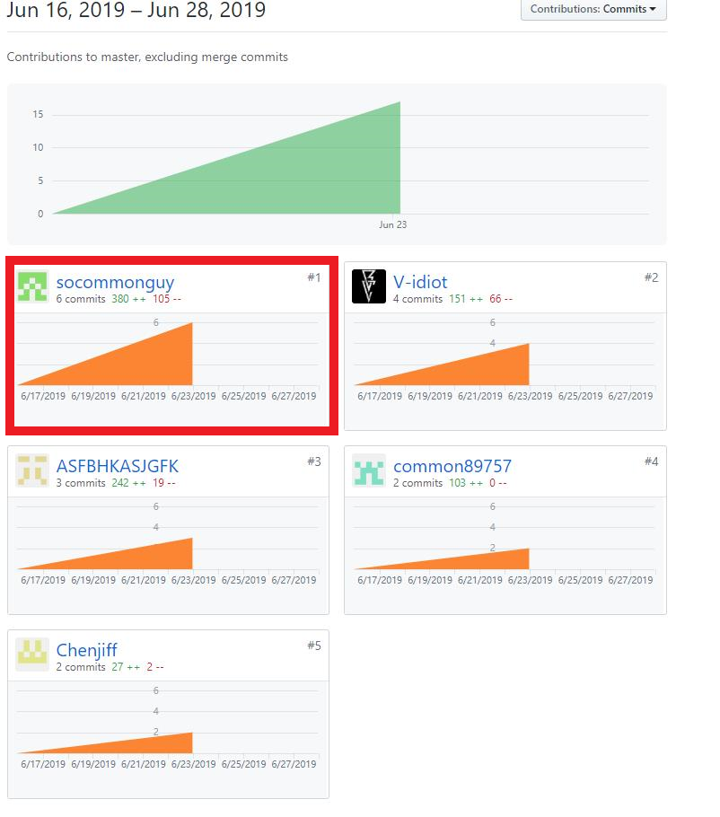
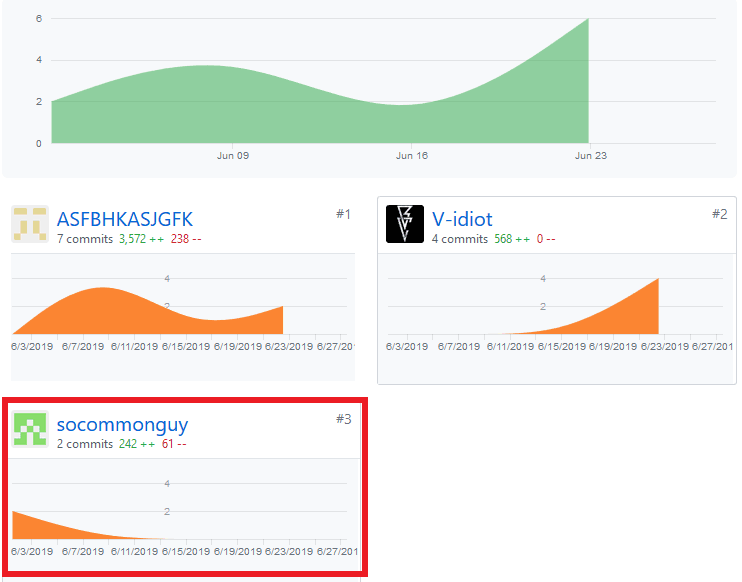

# 个人总结
姓名：卢浩榕 学号：15331223

昵称：socommonguy

分工：前端，产品经理

完成工作：前端个人信息页面，产品前期调研/竞品分析，项目愿景，产品特性库，需求规格说明书（状态模型，功能模型，补充需求），用例设计（注册登录）。
- 系分项目是我学习计算机以来做过的最正式和最完整的一次项目，从初期的需求讨论，期间的每次会议和软件的周期迭代，每个应该有的步骤都很完整。这次项目不仅让我了解了软件迭代的生命周期，也系统地学习了各种文档的编写以及UML图的绘制，让我了解到开放一个软件不仅仅是代码，软件开发中的每个步骤和细节都至关重要。

在开发过程中也让我清楚地认识到了如何站在用户的角度来考虑开发问题，软件的开发绝不能站在开发者的角度上想当然得进行，要多考虑用户的使用感，以提升用户的体验为目标。其次，各种UML图的绘制，例如用例图，活动图，时序图等等，在进行项目之前，我一直认为这些图的存在都是可有可无的，但是在项目开发过程总，我发现 用例图能够帮助数据库构建，而时序图则已经体现了一个程序的运行过程，程序员完全可以根据给出的时序图完成程序的编写，因此这些UML图在程序开发中确实有非常大的 作用，对于未来真正开发项目会有很大帮助。这些文档的编写都比较繁琐和复杂，我也真切地感觉到了开放软件的不容易。非常感谢队友们在开发过程的大力帮助，以及队长合理的任务分配和进度调控，感谢所有的小伙伴以及老师的帮助。

# PSP  2.1 统计表
| PSP2.1 | Personal Software Process Stages | Time (%) |
| ---- | ---- | ---- |
| __Planing__ | __计划__ | __7__ |
| Estimate | 预估任务时间 | 7 |
| __Development__ | __开发__ | __20__ |
| Analysis | 需求分析 | 50 |
| Design Spec | 生成设计文档 | 15 |
| Design Review | 设计复审 | 2 |
| Coding Standard | 生成代码规范 | 3 |
| Design | 具体设计 | 10 |
| Coding | 具体编码 | 30 |
| Code Review | 代码复审 | 5 |
| Test | 测试 | 5 |
| __Reporting__ | __报告__ | __8__ |
| Test Report | 测试报告 | 5 |
| Size Measurement | 计算工作量 | 1 |
| Process Improvement Plan | 事后总结及改进计划 | 2 |

# Git Stat

此为Dashboard贡献记录

此为前端贡献记录

# 最得意的工作
- 第一次做出了可视化的页面
- 第一次系统地完成项目文档的构建，了解了需求分析工作的重要性。
