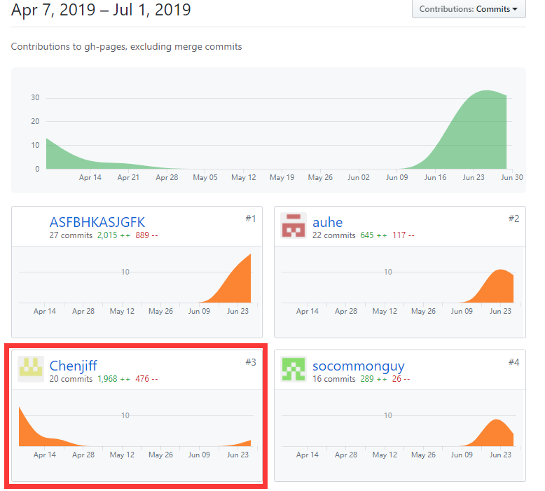

## 小组分工

| 学号     | 姓名   | 分工                 | 贡献率 |
| -------- | ------ | -------------------- | ------ |
| 16340020 | 陈吉凡 | 项目经理，后端，前端 | 35%    |
| 16340021 | 陈金坤 | 前端小组长           | 16%    |
| 16340019 | 陈泓霖 | 产品经理组长、前端   | 16.5%  |
| 16340124 | 李言   | 产品经理             | 6.5%     |
| 16340120 | 李明旭 | 后端                 | 16%    |
| 15331223 | 卢浩榕 | 产品经理，前端       | 10%  |

## 制品与贡献率

| 类型 | 制品     | 陈吉凡 | 陈金坤 | 陈泓霖 | 李言 | 李明旭 | 卢浩榕 |
| ---- | -------- | ------ | ------ | ------ | ---- | ------ | ------ |
| 源码 | 前端     | 30     | 30     | 30     | --   | --     | 10     |
| 源码 | 后端     | 65     | --     | --     | --   | 35     | --     |
| 文档 | 需求文档 | --     | --     | 33     | 33   | --     | 33     |
| 文档 | 设计文档 | 40     | 10     | 20     | --   | 20     | 10     |
| 文档 | 其他     | 20     | 20     | 10     | 10   | --     | 40     |

### 组员1

姓名：卢浩榕   
学号：15331223   
昵称：socommonguy   
分工：项目调研，需求分析，前端页面开发  
完成工作： 完成了需求分析，完成了用例设计，开发了“我的信息”页面。   
![][1]  

### 组员2

姓名：陈吉凡  
学号：16340020   
昵称：Chenjiff   
分工：后端开发、前端页面开发、项目管理   
完成工作制品：1. 后端服务层、控制层，测试部署。2. 前端主界面、任务详情界面、查看任务界面、发布任务界面、查看发布中的任务详情界面，查看进行中的任务单详情界面。3. API设计文档，架构设计文档、部署说明文档 、REST API规范文档、后端业务流程图、BCE映射指南等

后端仓库：    

   

前端仓库（开发1分支）： 

  

Dashboard:

  

###  组员3

姓名：陈金坤 
学号：16340021   
昵称：ASFBHKASJGFK  
分工：前端小组长    
完成工作：发布任务界面、进行中任务界面、发现任务界面、填写问卷界面、发布者问卷查询界面（js+wxml+wxss）+使用手册+用例设计文档(任务用例)  

前端仓库（开发2分支）：   

    

### 组员4

姓名：陈泓霖   
学号：16340019    
昵称：auhe  
分工：前端开发、UI设计  
完成工作：产品经理组长、UI设计、前端实现登录注册+个人信息+账户信息+任务信息页面、需求规格说明书与UI设计文档  

  

  

[1]:images/lhr-1.png  
  
### 组员5

姓名：李明旭   
学号：16340120    
昵称：common89757   
分工：后端开发，数据库设计  
完成工作：完成数据库设计，后端DAO层接口设计，书写数据库设计文档  
 
  

### 组员6

姓名：李言   
学号：16340124    
昵称：V-idiot   
分工：产品经理、协助前端开发  
完成工作：协助前端发布任务界面，需求文档中图片绘制，整理会议记录和项目文档  

